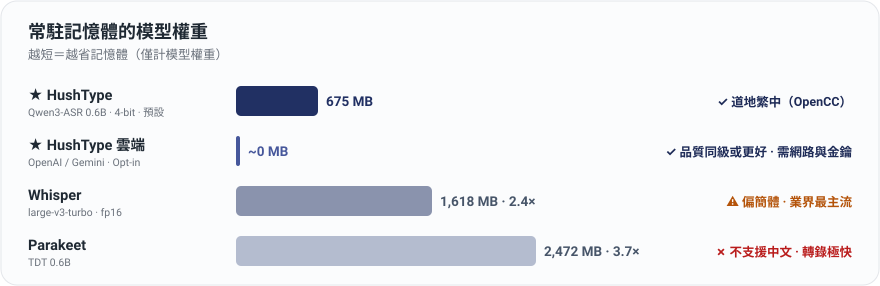
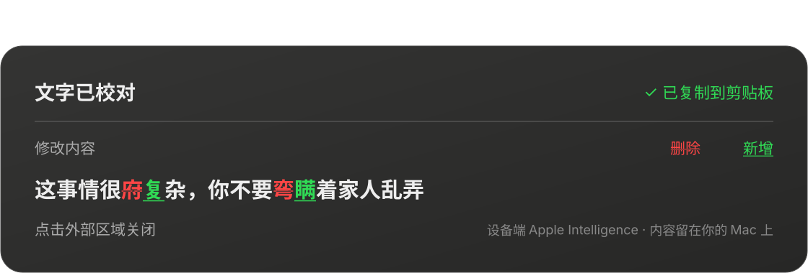

<p align="center">
  
</p>

<h1 align="center">HushType</h1>

<p align="center">
  专为 Apple Silicon macOS 打造的语音转文字应用<br>
  <strong>让语音输入更轻松，隐私由你掌控：</strong><br>
  第一版 F5 本地听写：单击 F5 开始录音，再次单击停止并插入文字；模型缓存后可完全离线。<br>
  要提升转录质量或省内存时，仍可根据需要使用你自己的密钥直连云端，无需第三方中转。
</p>

<p align="center">
  <a href="README.en.md">English</a> | <strong>简体中文</strong>
</p>

<p align="center">
  上游仓库：<a href="https://github.com/felixfu824/HushType">github.com/felixfu824/HushType</a>
</p>

> 本仓库是基于上游 HushType 的 fork；上游来源保留在上方链接，MIT 许可证保留在根目录 [LICENSE](LICENSE)。

> **HushType** 是一款免费、开源的 macOS 与 iOS 语音转文字应用。本分支的第一版 macOS 本地听写默认使用 `mlx-community/Qwen3-ASR-1.7B-8bit`（8-bit MLX），单击 F5 开始、再次单击 F5 停止并将结果插入光标位置；中文输出默认为简体中文。`aufklarer/Qwen3-ASR-0.6B-MLX-4bit` 保留为省电选项。模型下载并缓存后，F5 路径不需要 LM Studio、服务器或云端，完全离线运行。下方云端与 iOS 段落保留作为上游参考，并非第一版 F5 本地 MVP 的必要路径。

> 🌐 **HushType** is a free, local-first dictation app for Apple Silicon Macs (and iOS). In this fork's first macOS path, `mlx-community/Qwen3-ASR-1.7B-8bit` is the default local model: press F5 once to start, press F5 again to stop and insert the transcription. Simplified Chinese is the default output; the 0.6B 4-bit model remains the power-saving option. Once the model is cached, the F5 path runs fully offline with no LM Studio, server, or cloud dependency.<br>→ Read the full English README: [README.en.md](README.en.md)

<p align="center">
  
</p>

<sub>上方图表保留上游对 Qwen3-ASR 0.6B 4-bit 的内存比较，不能当成本分支默认模型的大小；本分支默认为 1.7B 8-bit，另提供 0.6B 4-bit 省电模式。云端引擎仍是可选功能，F5 本地路径不依赖它。</sub>

---

## 为什么选择 HushType

**隐私与主导权优先。** F5 本地模式下语音永远不离开你的 Mac，1.7B 8-bit 模型完全在本地运行；首次只需下载并缓存模型，之后录音、转录、插入文字都可在离线状态完成。选择加入云端听写时，音频用**你自己的密钥**经 HTTPS **直连** OpenAI 或 Gemini：中间没有 HushType 服务器，不会经过 HushType 的服务器，且每个会话第一次使用前都会先征求你的同意。**要不要把音频交给供应商，永远是你的决定。**

**质量优先，另有省电选项。** 本地默认是 Qwen3-ASR 1.7B 8-bit；如果更在意内存与功耗，可在设置中切换到 Qwen3-ASR 0.6B 4-bit。已加载的模型也可以在菜单一键卸载，切回本地引擎时再重新加载。

**云端听写（Opt-in）。** 三件事：(1) 支持 **OpenAI**（默认 `gpt-4o-mini-transcribe`）与 **Gemini**（默认 `gemini-3.5-flash-lite`，可选 `gemini-3.7-flash`），你的密钥、直连、无转发；(2) Gemini 有**免费（Free tier）API Key** 可零成本入门；但请注意：Google 免费方案可能用你提交的音频改进其产品，付费方案则不会；(3) 内置保护措施：逐次同意、每日花费提醒与当日锁定（默认 $5）、录音过长在上传前就拦截。

**默认输出简体中文，是否转换由你决定。** Qwen3-ASR 的原生中文输出默认保留为简体中文，方便和模型原始结果一致；需要繁体中文时，再从设置打开 OpenCC `s2twp`。支持同一句话中混用中英文识别，并可选择将中文数字根据语境转成阿拉伯数字（`一零一大楼` → `101 大楼`）。

**文字直接修正。** 在任何 App 选中文字、双击 Right ⌥，设备端 Apple Intelligence 模型直接直接校对并替换：错字、语法、标点。它是机械式校对员，不是改写器：语义、语气、中英混用全都原样保留（macOS 26+）。<br>注：Apple Foundation Model 的参数规模较小、能力有限，目前采用较保守的校对策略，有时会保留原文。

**字幕两种模式。** 本地 **Live Caption（实时字幕）** 通过本地处理流程，将字幕显示在浮动面板上：免费、离线、飞机上也能用（质量普通）。可选的 **Live Translated Caption（实时翻译字幕）** 将音频流发送到 OpenAI 的 `gpt-realtime-translate`，实时生成 14 种语言的字幕（高质量），密钥是你的（账单也是你的！），不自动启动。

---

## 主要功能

| 功能 | 默认 | 系统需求 |
|---|---|---|
| 单击 F5 开始、再次单击 F5 停止本地语音输入（macOS）| **ON（默认）** | macOS 15+、Accessibility |
| 本地模型：Qwen3-ASR 1.7B 8-bit | **默认** | Apple Silicon |
| 省电模型：Qwen3-ASR 0.6B 4-bit | 可选 | Apple Silicon |
| 按住 Right ⌥ 进行原有语音输入（macOS）| ON | macOS 15+ |
| **云端语音输入（OpenAI / Gemini，Opt-in）**：零模型内存，逐次同意 | OFF | 你自己的 API 密钥 |
| 轻按 Right ⌥ 翻译选中的文字 | OFF | macOS 15+ |
| 双击 Right ⌥ 校对选中的文字，直接修正 | **ON** | macOS 26 + Apple Intelligence |
| **Live Caption（本地，免费）**：浮动字幕面板，麦克风或系统音频 | OFF | macOS 15+ |
| **Live Translated Caption（云端，约 $2/小时）**：实时外文翻译字幕，使用 OpenAI | OFF（自行打开） | 你自己的 OpenAI API key |
| Right ⌘ + /：切换上次用过的字幕模式 | - | macOS 15+ |
| 英文 / 中文 / 日文 + 原生混用 | ON | - |
| 简体中文输出 | **ON（默认）** | - |
| 简体 → 繁体后处理（OpenCC `s2twp`）| OFF | 可选 |
| 阿拉伯数字转换（确定性 ITN）| **ON** | - |
| 中文标点清理，修剪模型过度断句（soft / hard / off）| **soft** | - |
| 自定义字典（专有名词 / 行话）| 文件驱动 | - |
| 界面语言（跟随系统 / English / 繁体中文）| 跟随系统 | - |
| 浮动「Listening / Transcribing」指示条 | ON | - |
| 卸载语音转文字模型 | 一键 | - |
| iOS App + 自定义键盘（以 Mac 为服务器）| 可选 | iOS 17+、Mac 上需有 Python |

---

## 使用场景

**与 AI 助手对话。** 给 Claude 或 ChatGPT 一段详细的 prompt，打字要 5 分钟，口述只需 30 秒。单击 F5 开始，自然地说完整段 prompt（可任意混用语言），再次单击 F5 停止，文字立刻出现在聊天输入框中。本地转录意味着：即使你正在使用云端托管的 AI 助手，你的 prompt 也不会离开你的机器。

**内存紧张时。** Claude Code 同时运行三个会话、浏览器开 20 个标签页，不想再多一个常驻模型？菜单切到 OpenAI 或 Gemini 云端引擎，本地模型保持卸载、听写照用，每句多等一两秒、费用记在你自己的 API 账单上（若使用 Gemini Free-tier API Key：$0）。

**通勤时的语音笔记。** 在地铁上，Mac 留在家里。在 iPhone 上点「Start Listening」，切到备忘录，按 HushType 键盘上的麦克风按钮。语音通过 Tailscale 传回你的 Mac，约 1 秒完成转录，文字出现。<br>说明：手机端功能已有较长时间未测试。

**阅读其他语言。** 在 Safari、Mail、备忘录等任何 App 中选中文字，轻按 Right ⌥。翻译结果会显示在半透明卡片中，使用 Apple 设备端 Translation Framework。10 秒后自动关闭、光标停留会暂停倒计时。无 API 密钥、无云端。

**在原地把文字改对。** 语音输入的 Slack 回复、打太快满是错字的留言、有 typo 的中英夹杂句，选中、双击 Right ⌥，修正后的文字直接落回原处（同时保留在剪贴板）。不用粘贴到聊天机器人，再复制回来，也不用担心 AI「顺便帮你润色」：只做修正，其他一律不动。

**看外语内容。** 韩剧、日本新闻、西语足球转播。在应用中打开要观看的内容，菜单栏 → **Live Translated Caption → From System Audio…** 选择该应用，翻译后的英文（或你设置的目标语言）会实时显示在屏幕下方的浮动字幕面板。Right ⌘ + / 开关。原文小灰字在翻译上方一起显示，方便确认翻译没走偏；面板顶部的费用条会实时显示本次会话在你 OpenAI 账户上的累计花费。

---

## 工作原理

```
macOS（默认本地，不需要网络）：
  单击 F5 → 开始录音 → 再次单击 F5 → 停止、转录、文字出现在光标位置
  轻按 Right Option（<0.3 秒）+ 选中文字 → 翻译卡片
  选中文字后双击 Right Option → 直接校对（Text Polish）
  本地流程：F5 → 麦克风 → Qwen3-ASR 1.7B 8-bit（MLX、设备端推理）→ 简体中文输出 → 粘贴
  云端流程（选择加入）：麦克风 → 你的 Mac → HTTPS 直连 OpenAI/Gemini → 同一套 OpenCC/ITN 后处理 → 粘贴
                        （没有 HushType 服务器这一站）

iOS（通过你的 Mac 作为服务器）：
  打开 HushType → 开始听写 → 切到任何 App → HushType 键盘 → 按麦克风
  流程：iPhone 麦克风 → WiFi/Tailscale → Mac 服务器 → Qwen3-ASR → OpenCC → 结果返回 → 文字插入
  （iOS 服务器一律使用本地模型）
```

```
                                     ┌──────────────────────────────────┐
                                     │  Mac (Apple Silicon)             │
  ┌──────────────┐   WiFi/Tailscale  │                                  │
  │ iPhone       │ ──── HTTP POST ──►│  ios_server.py (port 8000)       │
  │ HushType KB  │◄── JSON result ───│    ↓                             │
  └──────────────┘                   │  mlx-audio (port 8199)           │
                                     │    → Qwen3-ASR 0.6B (MLX/Metal)  │
                                     │    → OpenCC s2twp                │
                                     │                                  │
                                     │  HushType.app (菜单栏)            │
                                     │    → F5 本地听写快捷键            │
                                     │    → 本地转录                     │
                                     └──────────────────────────────────┘
```

---

## 安装

### 方案 A：下载 DMG（不需要任何开发工具）

1. 从[最新版本](https://github.com/felixfu824/HushType/releases)下载 `HushType.dmg`
2. 打开 DMG，将 HushType 拖到「应用程序」
3. 右键点击 HushType.app → 打开（首次启动时需要，App 使用临时签名，未经 Apple 公证）
4. 授予**辅助功能**与**麦克风**权限
5. 等待 Qwen3-ASR 1.7B 8-bit 模型下载（仅首次，进度显示在菜单栏）

DMG/App 对本地简体中文路径是独立版本，运行时不需要 Homebrew 或 LM Studio。

> **iOS 服务器支持：** DMG 也包含菜单栏中的 iOS 服务器切换功能。需要额外安装 Python 3 及相关软件包，参见下方 [iOS 安装指南](#安装指南iosiphone--mac-服务器)。若缺少依赖项，App 会显示错误消息及所需的 `pip3 install` 命令。

### 方案 B：从源代码编译

参见下方[环境要求](#环境要求与依赖项)及 [macOS 安装指南](#安装指南macos)。

---

## 更新

更新等于**覆盖 `.app` 文件夹**。偏好设置、ASR 模型、用户数据都存在 `.app` 外面，不受影响。

**DMG：** 退出 HushType → 打开新 DMG → 拖 `HushType.app` 到窗口内的 Applications 快捷方式（点 **替换 / Replace**）→ 从 Spotlight 重启。

**从源代码编译：** `git pull && make install`。

**为什么每次更新都可能要重新授权？** HushType 是 ad-hoc 签名，macOS 可能会在更新后要求你重新启用辅助功能权限。设置窗口会显示目前权限状态。点 **Open System Settings**，在辅助功能列表里打开 HushType，接着点 **Restart HushType** 让 macOS 应用权限。如果你看到重复的 HushType、找不到 HushType，或开关无法正常运行，请在设置窗口中使用 **Reset Old HushType Entry**，再重新加入或启用 HushType。

**完全卸载：** 把 `/Applications/HushType.app` 拖到废纸篓；如需连偏好与模型一起清除，再删除 `com.felix.hushtype` defaults domain 与 `~/Library/Caches/qwen3-speech/models/`。

---

## 环境要求与依赖项

> **注意：** 若你使用 DMG 安装（方案 A），可跳过此段，所有依赖项均已包含。以下仅适用于从源代码编译或设置 iOS 服务器。

**硬件与系统：**

| 需求 | 用途 |
|---|---|
| Apple Silicon Mac（M1 以上）| MLX 推理需要 Metal GPU |
| macOS 15.0+ | speech-swift 最低版本需求 |
| iPhone（iOS 17+）| iOS 客户端（可选）|

**软件依赖项（从源代码编译）：**

| 软件包 | 用途 | 安装方式 | 适用场景 |
|---|---|---|---|
| [Homebrew](https://brew.sh) | 包管理器 | 见 brew.sh | 从源代码编译 |
| [opencc](https://formulae.brew.sh/formula/opencc) | 简体 → 繁体中文 | `brew install opencc` | 从源代码编译（DMG 已包含）|
| [speech-swift](https://github.com/soniqo/speech-swift) | Apple Silicon 上的 Qwen3-ASR（MLX）| SPM 自动安装 | 从源代码编译 |
| [Python 3.11+](https://python.org)（根据 mlx-audio 要求） | iOS 服务器运行环境 | `brew install python` | 仅 iOS |
| [mlx-audio](https://github.com/Blaizzy/mlx-audio) | iOS 用的 STT 服务器 | `pip3 install "mlx-audio[stt,server]"` | 仅 iOS |
| [httpx](https://www.python-httpx.org/) | 代理服务器用的异步 HTTP | `pip3 install httpx` | 仅 iOS |
| webrtcvad-wheels, setuptools | mlx-audio 运行依赖 | `pip3 install webrtcvad-wheels setuptools` | 仅 iOS |
| [xcodegen](https://github.com/yonaskolb/XcodeGen) | iOS Xcode 项目生成器 | `brew install xcodegen` | 仅 iOS |
| [Xcode 16+](https://developer.apple.com/xcode/) | 编译 iOS App | Mac App Store | 仅 iOS |
| [Tailscale](https://tailscale.com) | 加密的 iPhone-to-Mac 连接 | 见 tailscale.com | 可选 |

---

## 安装指南：macOS

### 步骤 1：下载与编译

```bash
git clone https://github.com/felixfu824/HushType.git
cd HushType

# 安装依赖项
brew install opencc

# 编译并安装到 /Applications
make install
```

### 步骤 2：启动并授予权限

1. 从 Spotlight 启动 HushType（Cmd+Space → HushType）
2. 首次启动时，**Set Up HushType** 窗口会列出需要的权限：辅助功能与麦克风。
3. 在辅助功能卡片点 **Open System Settings**。在辅助功能列表中找到 HushType 并**打开开关**。如果列表里没有 HushType，可以使用小型提示窗口把 HushType 拖进列表。
4. 点 **Allow Microphone**，并在 macOS 麦克风权限提示中允许。
5. 回到 HushType，点击 **Restart HushType**：App 会自动重新启动，让新授予的辅助功能权限生效。（macOS 会在 进程级别缓存权限检查结果，所以授予权限后必须重启，HushType 会帮你处理这个步骤。）
6. 等待 Qwen3-ASR 1.7B 8-bit 模型下载（仅首次，进度显示在菜单栏）

### 步骤 3：使用

- **单击 F5**：开始录音。F5 不需要按住，屏幕底部出现「Listening」指示条与音量条。
- **再次单击 F5**：停止录音，指示条切换为「Transcribing」，文字粘贴到光标位置并保留在剪贴板。

**菜单栏：**

- **语音输入设置**（子菜单，集中所有听写相关设置）：
  - **本地模型**：Qwen3-ASR 1.7B 8-bit（默认）/ 0.6B 4-bit（省电）；切换后卸载并重新加载模型即可生效
  - **语音转文字语言**：Auto / English / 中文 / 日语（识别语言，非界面语言）
  - **Number Conversion**：中文数字 → 阿拉伯数字（默认打开）
  - **标点清理**：温和 / 强力 / 关闭（默认温和）
  - **Show Floating Indicator**：切换指示条（默认打开）
  - **Edit Customized Dictionary**：`~/Library/Application Support/HushType/dictionary.txt`，`source -> target` 一行一条，保存自动热重载
- **Unload Speech-to-Text Model**：一键释放本地模型内存；同一菜单可重新加载（约 3 秒冷启动）
- **Quit HushType**

到此结束。模型下载完成后，F5 本地模式不需要服务器、不需要网络、不需要额外设置。

### 上游云端代码

仓库仍保留上游 OpenAI/Gemini 实现，方便未来恢复，但这个本地 MVP 已刻意隐藏相关菜单并禁用云端引擎选择；上游云端操作说明不适用于本版。

### 可选功能：Live Caption / Live Translated Caption（macOS 15+）

两种共用同一块浮动字幕面板的功能，运行时互斥，启动其中一个会自动停止另一个。

**Live Caption（本地、免费、设备端）：**

1. 菜单栏 → 点 **Live Caption** 直接切换（使用上次的音频来源，首次默认麦克风），或明确选 **From Microphone** / **From System Audio…**。
2. 第一次选 System Audio 会弹出选择器，让你选择要监听的应用。
3. 字幕会出现在屏幕下方的浮动面板，面板可拖动、可调整大小，下次打开会记住位置。

**Live Translated Caption（云端，约 $2/小时，费用计入你自己的 OpenAI 账户）：**

1. 在 https://platform.openai.com/api-keys 获取 API key。
2. 菜单栏 → **Live Translated Caption → Translated Caption Settings…** → 点 **Open file in TextEdit**，把 key 粘贴到 `openai.json` 的 `api_key` 字段。
3. 在同一个设置窗口选目标语言（默认英文；另支持 13 种，含 繁体中文 / 简体中文 / 日语 / 한국어 / Español / Français / Deutsch）。
4. 菜单栏 → **Live Translated Caption → From Microphone**（或 **From System Audio…**）开始。首次使用会弹出免责声明，接受后不再重复显示。
5. 字幕面板顶部会出现费用条（例如 `12:34 · $0.42`），实时显示会话时间与累计花费。自动停止分钟数与日花费上限提醒都在同一个设置窗口可调。

**快捷键（两种共用）：** Right ⌘ + / 切换**上次用过的那种模式**。首次默认本地 Live Caption。要精确选择哪个模式 + 哪种音频来源，从菜单栏点击是最直接的方式。

**模式切换：** 在一个模式运行中点另一个模式的菜单项，会自动停止当前的、启动新的。同一个模式换音频来源（mic ↔ system）会原地切换、不重建面板。

### 可选功能：文字翻译

使用 Apple Translation Framework 在设备端翻译。选中任何文字 → 轻按 Right Option（<0.3 秒）→ 浮动卡片显示翻译，并自动复制到剪贴板。卡片 10 秒后自动关闭，光标停留可暂停，点击或按 Escape 立即关闭。

**方向：** 中文 → 英文；其他 → 繁体中文。可从菜单栏或 `defaults write com.felix.hushtype hushtype.translateTargetLanguage` 覆盖。

**启用：** 菜单栏 → **Text Translation**。会做一次可用性测试，若 Translation Framework 不可用会显示明确的错误消息。

### 可选功能：Text Polish（macOS 26+）

使用 Apple Foundation Models 框架在设备端校对，就是 macOS 内置的 Apple Intelligence 模型，不增加 HushType 的内存预算，内容也不离开你的 Mac。在任何 App 选中文字 → 双击 Right Option → 选中范围直接替换为修正后的文字，结果卡片以 Word 追踪修订的方式显示到底改了什么：删除的字红色删除线、加入的字绿色下划线。

<p align="center">
  
</p>有修正时，修正后的文字同时保留在剪贴板，所以只读画面（网页、PDF）也能用：选中、双击、粘贴到需要的位置。原本就正确的文字会显示「No changes needed」卡片，剪贴板完全不动。右键菜单也有：**服务 → Polish with HushType**。

**它修什么：以及它绝不碰什么。** 错字、语法、标点、明显的 typo。它刻意设计成机械式校对员，而非改写器：语义、语气、格式、大小写、语言混用全部保留。它被要求遵守的规则：

- **绝不翻译。** 中英夹杂的句子保持夹杂。如果模型把其中一种语言翻掉了，HushType 会在输出端检测到、带着更强的指令重试一次，仍然失败则显示提醒，而不是粘贴误译。
- **绝不简繁互转**，两个方向都不会。
- **绝不回答。** 看起来像问题或指令的选中文字，一律当成待校对的文字，不当成要运行的 prompt。
- **不碰代码。** 像代码的选中会显示提醒并取消操作；一般文字里的 URL、文件路径、反引号内容原样保留。
- **失败会明讲，不会默默出错。** 如果模型输出看起来坏了（长度异常、少了一种语言），你会看到提醒，原文完全不动。

**能力边界（诚实说明）：** 背后是 Apple 设备端的小型模型，取舍如下，**英文修正最可靠**；**中文偏保守**，语法依存的错字（的／得、在／再）往往无法识别；**选中越长越容易返回「No changes needed」**，一次选一两句效果最好。这是刻意的设计：模型没把握时就原文返回，宁可漏修，也绝不乱改。

**速度：** 通常约 1-3 秒。HushType 会保持一个已预热的模型会话，提前处理提示词，减少双击后的等待时间。

**自定义规则：** 菜单栏 → **Edit Polish Instructions** 打开 `~/Library/Application Support/HushType/polish_rules.txt`。一行一条短规则（`#` 开头为注释），会合并进内置 prompt，例如 `使用简体中文常用表达` 或 `Use the Oxford comma.`。保存即生效，不用重启。

**需求：** macOS 26（Tahoe）+ 已启用 Apple Intelligence + Apple Silicon。默认打开；没有 Foundation Models 的 Mac 上双击不会有反应，改用 **服务 → Polish with HushType** 会显示清楚的原因。可从菜单栏（**Text Polish**）或 `defaults` 开关。

## 安装指南：iOS（iPhone + Mac 服务器）

iOS App 使用你的 Mac 作为转录服务器。iPhone 通过 WiFi 或 Tailscale 将音频发送到 Mac，再接收转录好的文字。

### 步骤 1：在 Mac 上安装服务器依赖项

```bash
# 转录服务器的 Python 软件包
pip3 install "mlx-audio[stt,server]" webrtcvad-wheels setuptools httpx

# OpenCC（繁体中文转换）+ xcodegen（iOS 项目生成器）
brew install opencc xcodegen
```

### 步骤 2：获取 Mac 的 IP 地址

```bash
# 使用 Tailscale（随处皆可连接）:
tailscale ip -4
# 示例输出:100.x.x.x

# 仅使用局域网（同一 WiFi）:
ipconfig getifaddr en0
# 示例输出:192.168.50.50
```

记下这个 IP，稍后会在 iPhone 上输入。

### 步骤 3：在 Mac 上启动 iOS 服务器

**方法 A，从 HushType 菜单栏（推荐）：**
点击菜单栏的 HushType 图标 → "Start iOS Server"

**方法 B，从终端：**
```bash
cd HushType
python3 scripts/ios_server.py
# 服务器启动在 0.0.0.0:8000
# 首次转录请求会下载模型（约 675 MB）
```

验证服务器是否运行：
```bash
curl http://localhost:8000/
# 应返回:{"status":"ok","service":"HushType iOS Server","opencc":true}
# （opencc:false 表示尚未 brew install opencc）
```

### 步骤 4：编译并安装 iOS App

```bash
cd iOS
xcodegen generate
open HushType.xcodeproj
```

在 Xcode 中：
1. 点击左侧导航的 **HushType** 项目
2. 选择 **HushType** target → Signing & Capabilities → 设置 **Team** 为你的 Apple ID
3. 选择 **HushTypeKeyboard** target → 同样设置 **Team**
4. 如果 Xcode 显示 "Update to recommended settings" → 点击 **Perform Changes**
5. 用 USB 连接 iPhone
6. 选择你的 iPhone 作为运行目标（顶部字段）
7. 点击 **Run**（Cmd+R）

首次编译约需 1 分钟，之后会更快。

### 步骤 5：设置 iPhone

以下步骤在 iPhone 上操作：

**5a. 启用开发者模式**（仅首次）：
1. 设置 → 隐私与安全性 → 开发者模式 → 打开
2. iPhone 会重新启动。重启后确认「打开」。

**5b. 信任开发者**（仅首次）：
1. 设置 → 通用 → VPN 与设备管理
2. 点击「开发者 App」下你的 Apple ID
3. 点击**信任**

**5c. 加入 HushType 键盘**（仅首次）：
1. 设置 → 通用 → 键盘 → 键盘 → **添加键盘**
2. 往下滑到「第三方键盘」→ 点击 **HushType**
3. 点击列表中的 **HushType** → 打开**允许完全访问** → 确认

> **重要：** 必须启用「允许完全访问」。没有打开的话，键盘无法与主 App 通信，也无法访问网络。如果按麦克风没反应，这是最常见的原因。

### 步骤 6：设置与测试

1. 在 iPhone 上打开 **HushType** App
2. 输入 Mac 的 IP 地址：`http://<你的IP>:8000`（步骤 2 获取的 IP）
3. 点击 **Test Connection** → 应显示绿色 "Connected"
4. 点击 **Start Listening**：屏幕顶部出现橙色麦克风指示灯
5. App 显示 5 分钟倒计时

### 步骤 7：开始使用

1. 切到任何 App（消息、备忘录、Safari 等）
2. 长按**地球键** → 选择 **HushType**
3. 点击**麦克风按钮** → 说话 → 点击**停止**
4. 等待 1-2 秒 → 转录的文字出现在光标位置
5. 使用**空格键**、**删除键**和 **return** 进行基本编辑

5 分钟听写时长到期后，回到 HushType App 再按一次「Start Listening」。

### 设置完成后：日常使用

每天只需重复步骤 3 + 6-7:
1. 确认 Mac 上的 iOS 服务器已启动（菜单栏 → "Start iOS Server"）
2. 在 iPhone 打开 HushType → Start Listening
3. 切到你的 App → 使用键盘

USB 线只在安装/更新 App 时需要。日常使用完全无线。

> **注意：** 使用免费 Apple ID 部署，App 每 7 天会过期。停止运行时，重新接上 USB → Xcode → Cmd+R 重新安装即可。设置会保留。付费 Apple Developer 账号（US$99/年）可延长至 1 年。

---

## 设置

### macOS

```bash
# 查看所有设置
defaults read com.felix.hushtype

# 语言:nil=自动, "english", "chinese", "japanese"
defaults write com.felix.hushtype hushtype.language -string "chinese"

# 模型：macOS 默认 "mlx-community/Qwen3-ASR-1.7B-8bit"（1.7B、8-bit MLX 量化）；
# 可选 "aufklarer/Qwen3-ASR-0.6B-MLX-4bit" 以省电和降低内存占用。
defaults write com.felix.hushtype hushtype.modelId -string "mlx-community/Qwen3-ASR-1.7B-8bit"

# 语音输入引擎:"local"（默认）/ "openai" / "gemini"，跨重启保留
defaults write com.felix.hushtype hushtype.dictationEngine -string "local"

# 云端听写模型（每个供应商各自记住）
defaults write com.felix.hushtype hushtype.cloudDictationModelOpenAI -string "gpt-4o-mini-transcribe"
defaults write com.felix.hushtype hushtype.cloudDictationModelGemini -string "gemini-3.5-flash-lite"

# 繁体中文转换（默认:false；本地输出默认为简体中文）
defaults write com.felix.hushtype hushtype.chineseConversionEnabled -bool false

# 中文数字转阿拉伯数字（ITN,默认:true）
defaults write com.felix.hushtype hushtype.numberConversionEnabled -bool false

# 底部浮动「Listening / Transcribing」指示条（默认:true）
defaults write com.felix.hushtype hushtype.floatingOverlayEnabled -bool false

# Text Polish：双击 Right ⌥ 直接校对选中文字
# （默认:true,需要 macOS 26 + Apple Intelligence）
defaults write com.felix.hushtype hushtype.textPolishEnabled -bool false

# 通过 Apple Translation Framework 的文字翻译（默认:false）
defaults write com.felix.hushtype hushtype.textTranslationEnabled -bool true

# 翻译目标语言（默认:nil = 自动，中文→英文,其他→繁体中文）
# 设置特定语言代码可覆盖（例:"en"、"zh-Hant-TW"、"ja"）
defaults write com.felix.hushtype hushtype.translateTargetLanguage -string "en"
```

### iOS

- 服务器网址：在 App 界面中设置（保存在 App Group）
- 听写时长：5 分钟（写在 BackgroundAudioManager.swift 中）
- 模型：`mlx-community/Qwen3-ASR-0.6B-4bit`（写在 RemoteTranscriber.swift 中）

### 更改快捷键（macOS）

F5 是第一版内置的单键切换（标准键码 96；部分媒体键盘使用 176），按一下开始、再按一下停止。若要调整原有 Right Option 路径，编辑 `Sources/HushType/HotkeyManager.swift`:
```swift
private static let rightOptionKeyCode: Int64 = 61
```

常用键码：Right Option （61）、Right Command （54）、Left Option （58）、Left Control （59）、Fn/Globe （63）。

---

## 隐私与安全

两种模式，同一个原则：**无需第三方中转，决定权永远在你手上。**

### 本地模式（默认）

- **不保存任何录音。** 语音数据仅存在于内存中（录音 → 转录流程），完成后即丢弃。无论 macOS 或 iOS 服务器，都不会将任何音频写入磁盘。
- **设置完成后不需要网络。** 唯一需要连网的是首次启动时下载 Qwen3-ASR 1.7B 8-bit 模型。之后，F5 本地 App 与模型完全离线运行，零对外连接。
- **无遥测。** 无分析追踪、无使用统计、无返回机制。macOS App 除了初始模型下载（由 speech-swift 内的 HuggingFace Hub SDK 处理）以及可选的 GitHub releases 更新检查外，不包含任何本地模式网络代码。
- **可完全离线运行。** 把完整模型文件夹复制到 `~/Library/Caches/qwen3-speech/models/mlx-community/Qwen3-ASR-1.7B-8bit/`；省电模式则放到 `~/Library/Caches/qwen3-speech/models/aufklarer/Qwen3-ASR-0.6B-MLX-4bit/`。之后本地听写不需要网络。

### 云端模式（选择加入：云端语音输入 / Live Translated Caption）

- **中间没有转发服务器。** 音频会直接从你的 Mac 经 HTTPS（字幕为 WSS）发送给服务供应商（OpenAI / Google）。HushType 没有自己的服务器、不转发任何流量、看不到你的音频、密钥、或费用。
- **你的密钥、你的同意。** 默认全部关闭、需自行填入密钥打开；每个会话第一次云端使用前会先征求同意，绝无静默上传。密钥留空即完全禁用云端功能。
- **密钥保存。** 密钥存在 `~/Library/Application Support/HushType/`（`openai.json` / `gemini.json`），App 写入时自动设置 `0600` 文件权限，与 `.env` 文件同一个安全模型。
- **费用限制。** 每日花费提醒（默认 $5）在上传之前就拦截会超标的请求并锁定当日云端；录音过长在上传前就被拦截、绝不送出。
- **Gemini Free tier 说明。** 使用 Google 免费方案时，Google 可能会使用提交的音频来改进其产品；付费方案则不会。
- **状态语义。** 语音输入引擎的选择跨重启保留（让云端用户持续不占模型内存）。字幕的引擎标志每次重启重置回本地，但 Right ⌘ + / 会记得你**上次用过的字幕模式（含云端）**，且云端字幕的一次性免责说明只出现一次，上次用的是云端翻译字幕的话，重启后按快捷键会直接再开云端（计费）字幕。
- **iOS 音频留在你的网络中。** iPhone 音频直接发送到你的 Mac，通过局域网 WiFi 或 Tailscale（WireGuard 加密），不经过任何第三方服务器；iOS 服务器一律使用本地模型。

---

## 已知限制

- iOS 需要 Mac 开机且服务器运行中（无云端备用服务）
- 免费部署：iOS App 每 7 天过期（需通过 Xcode 重新签署）
- 听写时长固定为 5 分钟（尚无界面可调整）
- Mac 必须是 iPhone 可连接的（同一 WiFi 或 Tailscale）
- DMG 使用临时签名（未经 Apple 公证），首次启动时 macOS Gatekeeper 会发出警告，需右键 → 打开以继续
- Text Polish 继承 Apple Foundation Models 的模型限制：少数中文细微用法（如 的/得/地）可能维持原样；英文占比极高的混合句可能被拦截并显示提醒，而不是冒着误译风险粘贴。被拦截一律代表原文完全不动
